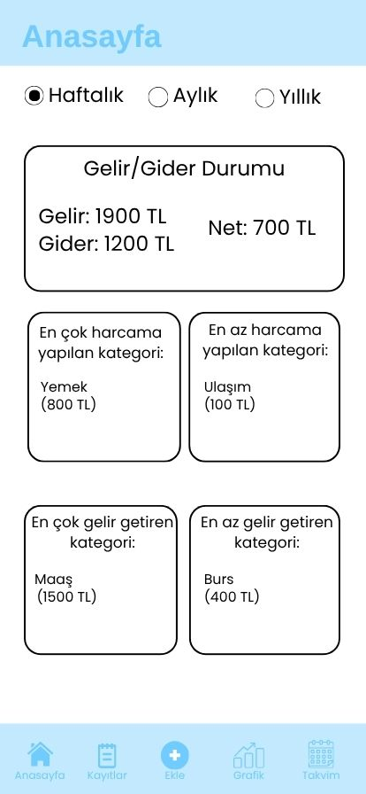
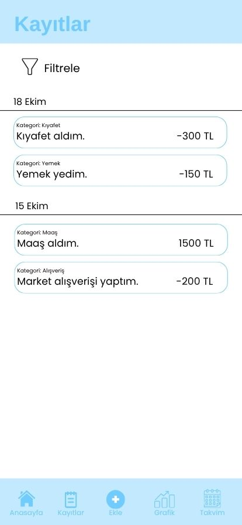
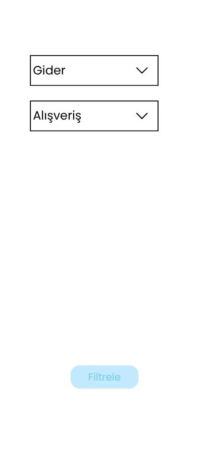

# 📈 Gelir-Gider Takip Uygulaması
Bu proje, kullanıcıların gelir ve giderlerini kolay bir şekilde takip edebilmelerini amaçlayan, Flutter ile geliştirilmiş bir mobil uygulamadır. Uygulama; kayıt yönetimi, filtreleme, grafikler ve takvim görünümü gibi özelliklerle finansal durumu daha anlaşılır hale getirmeyi hedefler.

## 📱 Proje Özellikleri
- Kayıt ekleme, güncelleme, listeleme ve silme işlemleri
- Haftalık, aylık ya da yıllık gelir-gider özetlerini görüntüleme
- Kayıtları tür/kategori ya da tutar aralığına göre filtreleme
- Gelir ve giderlerin haftalık, aylık ve yıllık olarak grafiksel gösterimi
- Takvim üzerinden günlük kayıtları görüntüleme

## ⚙️ Kullanılan Teknolojiler
- **Geliştirme Ortamı:** Android Studio
- **Framework:** Flutter
- **Programlama dili:** Dart
- **Veritabanı:** SQLite (sqflite paketi ile)
- **Grafik Kütüphanesi:** fl_chart
- **Takvim Kütüphanesi:** table_calendar

## 📸 Ekran Görüntüleri

## 🚀 Kurulum
1. Android Studio ve Flutter SDK yüklü olmalıdır, yüklü değilse uygun sürümleri indirip kurun.
2. Projeyi bilgisayarınıza indirin.
3. Projeyi Android Studio'da açın.
4. Gerekli paketleri Android Studio terminaline `flutter pub get` komutunu girerek yükleyin.
5. Projeyi derleyip çalıştırmak için `Android Studio > Device Manager` üzerinden sanal cihaz başlatın ya da USB ile bağlı bir cihaz kullanın.
6. Uygulamayı çalıştırın.

Not: Proje Flutter ile geliştirildiği için iOS platformunu da desteklemektedir. iOS build işlemleri macOS ortamında yapılabilir.

## 👩‍💻 Geliştirici
Firdevs Tosun